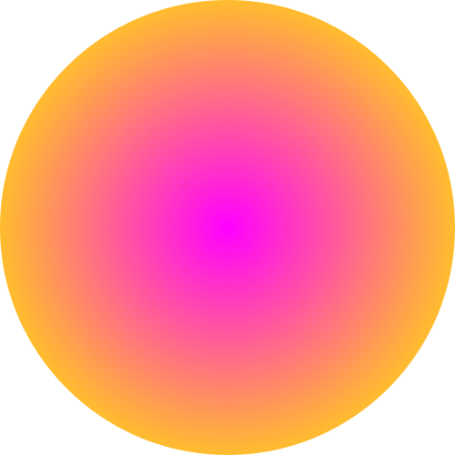

<div align="center">
    
</div>

# hitviz

Create simple visualizations of your javascript code execution as flickering dots.

[](https://github.com/sempostma/html2js-loader/blob/master/LICENSE.txt)
[](https://github.com/sempostma/html2js-loader/issues)
[](https://twitter.com/intent/tweet?text=Wow:&url=https%3A%2F%2Fwww.npmjs.com%2Fpackage%2Fhtml2js-loader)

## Install

```bash
npm i -D html2js-loader
```


## Usage

```javascript
const hitviz = require('hitviz');
const hit = hitviz();

const result = hit('hit1');
for(let i = 0; i < 20; i++) {
    hit('hit2');
}

result.svg() // returns a string containing a svg animation of your execution.
result.json() // returns the internal javascript object.
```

